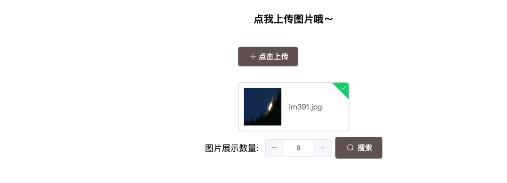

# Lab3: Information Retrieval


## 1. Requirements

Design an image search system that meets the following requirements:

- Include an input field for uploading an image (Formulation);
- Users can preview query images in the search window (Formulation);
- Have a search button (Initiation);
- Provide an overview of the results, such as the total number of results (Review);
- Allow changing search parameters when viewing results, such as selecting a category/tag (Refinement);
- Users can perform certain actions, such as adding selected images to a favorites list (Use).

## 2.Function Design

### 2.1 User uploads image(Formulation)


Here is the area where we upload photos that need to be searched for similar images. In this area, users click the "Upload" button as prompted to upload photos. 

To let users see the progress of the uploaded images, we added a progress bar on the upload interface to make users feel at ease. 

After the photo is successfully uploaded, it will be displayed below the button.



### 2.2  Search Images(Initiation & Review)

After uploading pictures, the user can select the number of images to display and click on the "Search" button to search. If the user has not uploaded any photos yet, the "Search" button will be disabled and cannot be clicked.


After conducting a search, the photos that meet the criteria will be displayed below.


### 2.3 Change Search Parameters(Refinement)

After conducting a search, users can see that each image card is labeled based on its category. Users can select the desired attributes in the tag bar above the image or deselect the attributes they don't need, and then refine the search results based on their selection.


For example, we can see that after unchecking the "plant_life" tag, all images with this tag no longer appear in the search results.


### 2.4 Image Preview(Formulation)


As shown in the left picture above, it is an example of a result card in the search results. We can see that there is a thumbnail of the image, favorite icon, enlarge icon, image name, and image tag information on this card. When we click the "enlarge icon", we can see the preview information of the image (as shown in the right picture above).

### 2.5 Add to Collection List (Use)

Similarly, by clicking on the "favorite icon" on the card, we can save the favorite images.


After a successful collection, the favorite icon will change to solid black and a pop-up window will appear indicating that the collection was successful. The images that have been collected can be found in the "My Collection" section of the menu.


## 3. UI

### Initial interface


### upload images


### Search images


### View collected images


(Note: This project requires installing dependencies using yarn. To install yarn, please enter the command "npm install yarn" in the terminal. If there are any difficulties during the operation, you can open my "demo video", which shows the detailed demonstration process.)
# How To Run My Project？

## Project Structure

```python
code
│  neighbor_list_recom.pickle
│  __init__.py
│          
└─server
    │  image_vectorizer.py
    │  neighbor_list_recom.pickle
    │  rest-server.py
    │  search.py
    │  
    ├─database
    │  │  favorites.txt
    │  │  
    │  ├─dataset # put your images for training into this folder 
    │  │      
    │  └─tags # put your tags into this folder
    │          
    ├─frontend
    │              
    ├─imagenet # put your classify_image_graph_def.pb into this folder
    │      
    ├─static
    │  ├─images
    │  │      
    │  └─result
    │          
    └─uploads
```

## Front-end

After you have entered the `code/server` folder, please run the command below:

```javascript
cd frontend
yarn install
yarn serve
```

Then you can see the website on `localhost:8080`

if you haven't install yarn yet, you can't open my website by this way. You should first use ``` npm ``` to install yarn.

```python
npm install yarn 
```

then add it to your environment variables.
After installation , you can use the command below to check if yarn is installed successfully.

```python
yarn --version
```

## Back-end

After you have entered the `code/server` folder and installed all dependencies, please run the command below:

```python
# train model
python image_vectorizer.py
# run back-end
python rest-server.py
```

Then the backend will run on ``` localhost:3367 ```.     

If you have any trouble running my project, you can see my "演示视频.mp4" in the folder.

